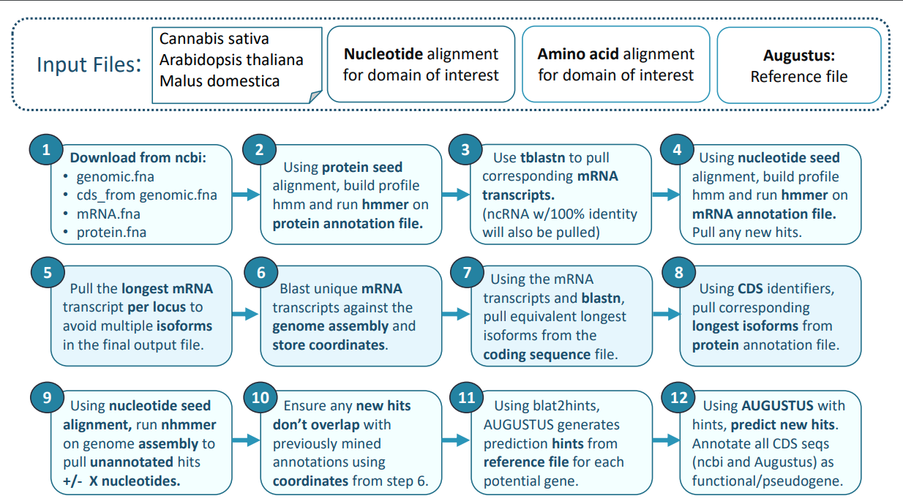

# TFAM
Transcription factor family annotation and mining tool

### <ins>Usage:</ins>
<b>perl TFAM.pl</b>

Note, the blat2hints.pl script must be in your working directory for augustus to work!

 

### <ins>Dependencies:</ins>
<ol type="1">
  
#### <li>HMMER:</li>
To install hmmer and easel miniapps, follow instructions from hmmer manual (pgs 17-18): 

http://eddylab.org/software/hmmer/Userguide.pdf

#### <li>BLAST:</li>
Download latest version of BLAST here: 

https://ftp.ncbi.nlm.nih.gov/blast/executables/blast+/LATEST/

#### <li>AUGUSTUS:</li>
Download AUGUSTUS here: 

https://github.com/Gaius-Augustus/Augustus 

#### <li>BLAT:</li>
Augustus requires blat to generate hints. Follow instructions here: 

https://bioinformaticsreview.com/20200822/installing-blat-a-pairwise-alignment-tool-on-ubuntu/ 
  </ol>
  

 

### <ins>Pipeline:</ins>

 

### <ins>Options and parameters:</ins>
<ol type="1">
<b>
<li> Options: 

</b>
<ul>
<li> <b> $annotation_available = "yes"</b> 
If NCBI RefSeq annotations are available for your genome, set this variable to "yes". Set as "no" if no annotations are available, and you wish to mine the assembly only. </li>

<li> <b> $cds_available = "yes" = "yes"</b> 
 Keep this as "yes" if cds files are available. Set as "no" if you only want to mine the mRNA files.

<li> <b> $predict_new_hits = "yes"</b> 
 If you want to predict any new, unannotated, hits with augustus, set this to "yes". If augustus is not installed, set this as "no". </li>

<li> <b> $augustus_species = "arabidopsis"</b> 
 If using augustus, set your closely related species here. This is the species that augustus is trained on. </li>

<li> <b>$minidentity = 60 </b> 
 If using augustus, this is the minimum identity required for alignment with a reference receptor to be used to generate prediction hints. </li>

<li> <b> $pseudogene_check = "yes" </b> 
 If yes, all cds seqs with in-frame stop codons, or below threshold length, will be annotated as pseudogenes. </li>

<li> <b> $pseudogene_length = 300 </b>
 Coding sequences below this length are considered pseudogenes (nucleotide length). </li>

<b>
</ul>
 
<li> Input files: 
    
</b> 
<ul> <b> $pfam_seed = "PF00319_seed.txt" </b> 
 Enter the name of your protein PFAM seed alignment here. </li>

<li> <b> $nuc_alignmnent = "nucletide_alignment" </b> 
 Enter the name of your nucleotide alignment here.

<li> <b> $reference_file = "reference_transcription_factors_mrna.fa" </b> 
  If augustus prediction ($predict_new_hits) option is on, enter the name of your reference file here.

<li> <b> $automate_download = "yes" </b> 
 If yes, script will use a list of species to download assembly and annotation files.

<li> <b> $species_list = "species.txt" </b> 
 Enter the name of your species list file here.

<b>
</ul>
 
<li> Parameters: 
    
</b> 
<ul> 
<li> <b> $default_phmmer_evalue = "yes" </b> 
 If “yes”, the default e-value will be used (1e-5). If “no”, you can enter a custom evalue in the 

<li> <b> $phmmer_evalue = "1e-5" </b> 
 If $default_phmmer_evalue is "no", enter your custom evalue here.

<li> <b> $default_nhmmer_evalue = "yes" </b> 
 If “yes”, the default e-value will be used (1e-5). If “no”, you can enter a custom evalue in the $nhmmer_evalue variable below.

  
<li> <b> $nhmmer_evalue = "1e-5" </b> 
 If $default_nhmmer_evalue is "no", enter your custom evalue here.	

<li> <b> $nhmmer_plus = 20000 </b> 
 Add X nucleotides to end of sequence (3' end) (cannot exceed 990,000 nt) 

<li> <b> $nhmmer_minus = 5000 </b> 
 Add X nucleotides to start of sequence (5' end) (cannot exceed 990,000 nt)

<b>
</ul>
 
<li> Profile hmm names: 
    
</b> 
<ul> 
<li> <b> $phmm_profile = "PF00319.hmm" </b> This is the name of your phmmer hmm profile. Recommend naming this the same as your protein PFAM seed alignment with the “.hmm” extension.

<li> <b> $nhmm_profile = "nucleotide_alignment.hmm" </b> This is the name of your nhmmer hmm profile. Recommend naming this the same as your nucleotide seed alignment with the “.hmm” extension.

<b>
</ul>
 
<li> Pseudogene vs Fuctional:
    
</b> 
<ul>
<li> <b> $annotation_short = "pseudogene_short" </b> 
 If prediction is shorter than $pseudogene_length (set below), genes will receive the above annotation in their sequence header. 

<li> <b> $pseudogene_length = “300”. </b> 
 Genes with cds lengths lower than this number be annotated as $pseudogene_short (above) regardless of conditions (1-6).

