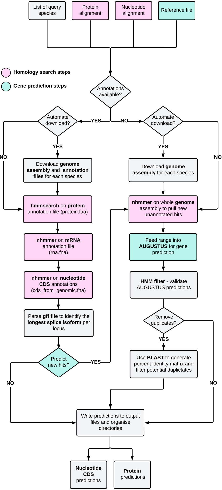
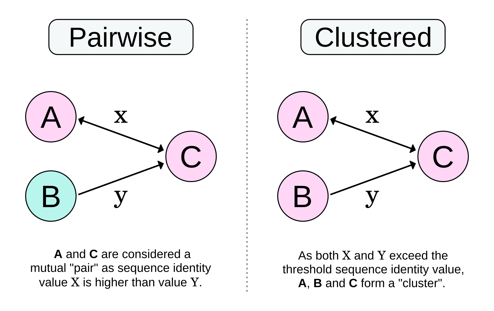

<p align="left">


<hr>

<br>

**GENE-FAM** is an automated pipeline designed to mine gene families based on conserved domains and motifs. The pipeline implements a series of homology searches and gene prediction steps to detect both annotated and previously unannotated loci across target genome assemblies. 

For an in-depth description of the pipeline and example applications, please see:

>Ryan L, Trubanova N, Pender G, Melzer R, Hughes GM, Schilling S. **GENE-FAM: An automated pipeline for mining gene families and its application to MADS-box genes in *Cannabis sativa***. *bioRxiv* (2026). [doi:10.64898/2026.06.10.731441](https://doi.org/10.64898/2026.06.10.731441).

<br>

## 📖 Contents
- [Installation and Dependencies](#dependencies)
- [The GENE-FAM Pipeline](#pipeline)
- [Running GENE-FAM](#running)
- [Preparing your Working Directory](#working-directory)
- [Input Files, Options and Parameters](#parameters)
- [Example Applications](#example-applications)
- [Citations](#citations)
<br>

<a id="dependencies"></a>
<h2> 🧩 Installation and Dependencies:</h2>

GENE-FAM can be run using Docker, which provides a pre-configured environment containing the required dependencies. A VirtualBox image is also provided as an alternative isolated environment. GENE-FAM can also be installed and run directly on your system by installing the required dependencies manually.

<p></p>
<p></p>

<h3>🐳 Docker:</h3>

The GENE-FAM Docker image is available on [Docker Hub](https://hub.docker.com/r/louiseryan314/gene-fam).
Instructions for using the GENE-FAM Docker image are provided below, in the [Running GENE-FAM](#running) section.

<p></p>
<p></p>

<h3> 💾 VirtualBox:</h3>

A preconfigured virtual machine for GENE-FAM is also available via
<a href="https://figshare.com/s/790244b8d1ba32c6ff29">Figshare</a>.
An illustrated guide is also provided, detailing how to install VirtualBox and load the GENE-FAM image.

<p></p>
<p></p>


<h3>🛠️ Manual installation:</h3>

<ol type="1">
  
#### <li>HMMER and Easel miniapps:</li>
To install hmmer and easel miniapps, please follow instructions below, as described in detail in the HMMER user manual (pgs 17-18): <p>
http://eddylab.org/software/hmmer/Userguide.pdf </p>

```
wget http://eddylab.org/software/hmmer/hmmer.tar.gz
tar zxf hmmer.tar.gz
cd hmmer-3.4
./configure --prefix /your/install/path   # NB: replace file path with your desired location
make
make check
make install       
cd easel; make install  # Install Easel tools
```

<p></p>

Alternatively, please visit the HMMER github page for instructions:

https://github.com/EddyRivasLab/hmmer

<p></p>
<p></p>


#### <li>AUGUSTUS:</li>
<b>Quick install with root privileges:</b>

```
#Linux
sudo apt-get update
sudo apt-get install augustus

#MacOS
brew update
brew install augustus
```

<p></p>

<b> Install AUGUSTUS with conda: </b>
```
conda install -c bioconda AUGUSTUS
```

<p></p>

<p><b>Install AUGUSTUS from source </b></p>
<p>AUGUSTUS dependencies: https://github.com/Gaius-AUGUSTUS/AUGUSTUS/blob/master/docs/INSTALL.md </p>
<p>Build AUGUSTUS: https://github.com/Gaius-AUGUSTUS/AUGUSTUS </p>

<p>Make sure to set your AUGUSTUS_CONFIG_PATH variable by appending the following to your <code>~/.bashrc</code> file (Linux) or <code>~/.zshrc</code> file (macOS):</p>

```
export AUGUSTUS_CONFIG_PATH=/my_path_to_AUGUSTUS/AUGUSTUS/config/    #where my_path_to_AUGUSTUS is dependent on where you cloned the AUGUSTUS repo
```

Troubleshooting:
If you have trouble installing AUGUSTUS from source, try setting the ZINPUT and COMPGENEPRED variables in the common.mk file to false.


<p></p>
<p></p>

 <b> Blat2hints:</b>
 
 GENE-FAM requires the blat2hints.pl script from AUGUSTUS. 
 
 Please download the script from the AUGUSTUS github page as linked below, and place the script in your working directory.
 https://github.com/nextgenusfs/AUGUSTUS/blob/master/scripts/blat2hints.pl 
 
<p></p>
<p></p>

 
#### <li>BLAT:</li>
AUGUSTUS requires blat to generate hints. To <b>download a precompiled version of BLAT</b> follow the below commands: <p>

```
# Linux
wget http://hgdownload.soe.ucsc.edu/admin/exe/linux.x86_64/blat/blat
chmod +x blat

# macOS
wget http://hgdownload.soe.ucsc.edu/admin/exe/macOSX.arm64/blat/blat
chmod +x blat

# If you have root privileges:
sudo cp blat /usr/local/bin/

# Alternatively you can add the blat file path to the '~/.bashrc' file (Linux) or '~/.zshrc' file (macOS), or copy 'blat' to your working directory:
cp blat /home/my/working/directory
```

<b> Install BLAT with conda: </b>
```
conda install ucsc-blat
```

Alternatively, you can install and compile blat following the instructions linked below:
https://bioinformaticsreview.com/20200822/installing-blat-a-pairwise-alignment-tool-on-ubuntu/ 

You may encounter the following error when installing libpng (dependency for blat): configure: "error: zlib not installed". To overcome this issue, try executing the following command:
```
sudo apt-get install zlib1g-dev
```

<p></p>
<p></p>

#### <li>BLAST (optional) :</li>
BLAST is only required if you want to remove potential duplicates in the output CDS files based on percentage identity. If you do not wish to use this feature, you do not need to install BLAST.

<b>Quick install with root privileges:</b>
```
#Linux:
sudo apt-get update
sudo apt-get -y install ncbi-blast+

#MacOS:
brew update
brew install blast
```

<b>Install BLAST from source:</b> <p>
Please download the latest version of BLAST from the following site:
https://ftp.ncbi.nlm.nih.gov/blast/executables/blast+/LATEST/

For instructions on how to configure BLAST, please see the NCBI website linked here:
https://www.ncbi.nlm.nih.gov/books/NBK52640/


</ol>
</p>

<br>
<br>

<a id="pipeline"></a>
<h2> 🧬 The GENE-FAM Pipeline:</h2>

<br>
<br>

<p align="center">

</p>

<br>
<a id="running"></a>
<h2> ⚙️ Running GENE-FAM:</h2>

<p>Prior to running GENE-FAM, the user should prepare their working directory and specify their input files and options as outlined in the instructions below. </p>
<p></p>To run the <b>GENE-FAM</b> pipeline using default settings, please use the following command:</p>

```
perl GENE-FAM.pl \
			--prot-alignment protein_alignment.fa \
			--nuc-alignment nucleotide_alignment.fa \
			--reference reference.fa
```

Note that the `--reference` option is only required when `--predict-new-hits yes` is used. If AUGUSTUS prediction is disabled using `--predict-new-hits no`, a reference file is not required.

Please see below for a detailed explanation of all available options and their default values. These options can also be viewed using:

```
perl GENE-FAM.pl --help
```


<h3>🐳 Running GENE-FAM using Docker:</h3>

<p>Before running GENE-FAM, please ensure that Docker is installed and running on your system. Docker Desktop can be downloaded from <a href="https://www.docker.com/products/docker-desktop/">Docker</a>.</p>

<p>The GENE-FAM Docker image is available on <a href="https://hub.docker.com/r/louiseryan314/gene-fam">Docker Hub</a>. The Docker image provides a preconfigured environment containing the required GENE-FAM dependencies.</p>

<p>To run GENE-FAM using Docker, first navigate to the directory containing your input files. Your current local directory can then be mounted inside the Docker container as <code>/data</code>. For example, to run GENE-FAM using default settings, use the following command:</p>

```
docker run --rm \
    -v "$PWD:/data" \
    -w /data \
    louiseryan314/gene-fam \
    --prot-alignment /data/PF00319_seed.txt \
    --nuc-alignment /data/MADS_nhmmer_alignment.fa \
    --reference /data/MADS_reference_file.fa
```

To see a list of options and parameters, please use the following command:

```
docker run --rm louiseryan314/gene-fam --help
```

<br>


<a id="working-directory"></a>
<h2> 📂 Preparing your working directory: </h2>


In order for the pipeline to work, you must first prepare your working directory with the required input files. The following files should be placed in your working directory: </p>


#### <ins>Scripts</ins>:

<ol type="1">
  
<li> <b> GENE-FAM.pl :</b></li> This is the pipeline script, which should be downloaded from this github repository. </p>
<li><b> blat2hints.pl :</b> </li> This script is required to generate hints which guide AUGUSTUS gene prediction. Please download this from the AUGUSTUS github repository (link above).

</ol>

  
#### <ins>Input Files</ins>: 

<ol type="1">
<li> <b> Protein alignment file: </b> </li> This protein alignment file should contain aligned amino acid sequences from your gene family of interest. If you are interested in a gene family in which members share a conserved domain, this alignment may contain sequences for the domain of interest. <b>Seed alignments for your domain of interest may be available for download from the <a href="https://www.ebi.ac.uk/interpro/entry/pfam/#table">InterPro</a> database</b>. </p>

<li> <b> Nucleotide alignment file: </b> </li> This nucleotide alignment file should contain aligned nucleotide sequences from your gene family of interest. Similarly to the protein alignment, this alignment may contain aligned sequences for a conserved domain of interest. </p>

<li> <b> Reference file: </b> </li> This file is used to guide AUGUSTUS gene prediction. This file should be in fasta format, and should contain nucleotide mRNA sequences from closely related species for your gene family of interest. </p>

<li> <b> Species list: </b> </li> This file is only required if you wish to automate the download of annotation files for a list of query species. This txt file should contain the species names, exactly as they appear on the NCBI RefSeq database. Please note that this feature only works for reference genomes which are available on the NCBI RefSeq database.

</ol> 
</ol>


#### <ins>Assembly and Annotation files:</ins>
If your query species is available on RefSeq, and the genome assembly of interest is the reference genome for that species, then the genome assembly and following annotation files can be automatically downloaded using GENE-FAM (please see options and parameters below). Otherwise, you should manually download the following files from the NCBI database for your query species. Note that if no annotation files are available for your query species, only the genome assembly should be downloaded. In this case, set the --annotation-available option to no when running GENE-FAM (see below for further instructions).

<ol type="1">
  
<li> <b> Genome assembly:</b></li> This is the genome assembly for your query species. The genome file should end in "genomic.fna" if downloaded from the NCBI database.  </li></p>
<li> <b> Protein annotations:</b></li> These are the protein sequence annotations downloaded from the NCBI RefSeq database. This file should end in "protein.faa". </li></p>
<li> <b> Nucleotide CDS annotations: </b></li> These are the nucleotide coding sequence annotations downloaded from the NCBI RefSeq database. This file should end in "cds_from_genomic.fna". </li></p>
<li> <b> mRNA annotations:</li> </b> These are the mRNA annotations downloaded from the NCBI RefSeq database. This file should end in "rna.fna". </li></p>
<li> <b> GFF file: </b></li> This is the GFF annotation file downloaded from the NCBI RefSeq database. This file should end in "genomic.gff".  </li>
</p>

</ol>
<br>

<a id="parameters"></a>
<h2>🎛️ Specifying your input files, options and parameters:</h2>

Input files, options, and parameters are specified using command-line arguments when running GENE-FAM. The available arguments and their default values can be viewed using:

```
perl GENE-FAM.pl --help
```

<b>

  
#### <ins> Input files and profile HMMs: </ins>
</b>

To specify the name of your protein alignment file, please use the `--prot-alignment` option as follows:

```
--prot-alignment protein_alignment.aln
```

</p>

To specify the name of your nucleotide alignment file, please use the `--nuc-alignment` option as follows:

```
--nuc-alignment nucleotide_alignment.aln
```

</p>

If the AUGUSTUS prediction option is on (`--predict-new-hits yes`), please enter the name of your reference file using the `--reference` option as follows:

```
--reference reference_file_name.fa
```

</p>

Profile HMMs will be automatically built from your alignment files. The names of these profile HMMs do not need to be specified.

</ul>
<br>


#### <ins> Options and parameters:</ins> 

<br>

<li> <b>General options:</b> </li> </p>

If NCBI RefSeq annotations are available for your genome, set the `--annotation-available` option to "yes". Set to "no" if no annotations are available, and you wish to mine the assembly only:

```
--annotation-available yes
```

</p>

If you want to automate the download of genome assemblies and annotation files for your given target species, please set the `--automate-download` option to "yes". Please note that this feature only downloads annotation files for reference species on the NCBI RefSeq database. If your target genome is not the reference genome for your query species, or if the genome assembly does not exist on RefSeq, please set this option to "no" and download the appropriate files manually.

```
--automate-download yes
```

</p>

If you selected "yes" for the `--automate-download` option, please specify your query species name(s) in a text file. Please specify the name of this text file using the `--species-list` option as follows:

```
--species-list species.txt
```

</p>
<br>

<li> <b>HMMER e-values:</b> </li> </p>

If you wish to use the default e-value (1e-5) for <b> hmmsearch (protein) </b>, please set the `--default-phmmer-evalue` option to "yes". For custom e-values, set this option to "no".

```
--default-phmmer-evalue yes
```

</p>

If the `--default-phmmer-evalue` option is set to "no", enter your custom e-value for <b> hmmsearch (protein) </b> using the `--phmmer-evalue` option as follows:

```
--phmmer-evalue 1e-5
```

</p>

If you wish to use the default e-value (1e-5) for <b> nhmmer (nucleotide) </b>, please set the `--default-nhmmer-evalue` option to "yes". For custom e-values, set this option to "no".

```
--default-nhmmer-evalue yes
```

</p>

If the `--default-nhmmer-evalue` option is set to "no", enter your custom e-value for <b> nhmmer (nucleotide) </b> using the `--nhmmer-evalue` option as follows:

```
--nhmmer-evalue 1e-5
```

</p>
<br>


<li> <b>AUGUSTUS options and parameters:</b> </li> </p>

If you want to predict new hits with AUGUSTUS, set the `--predict-new-hits` option to "yes". If AUGUSTUS is not installed, set this as "no":

```bash
--predict-new-hits yes
```

</p>

If using AUGUSTUS, the `--augustus-species` option corresponds to the species that AUGUSTUS is trained on. Please specify your closely related AUGUSTUS species using the `--augustus-species` option. For the list of available species, please visit the AUGUSTUS page linked here: https://github.com/Gaius-AUGUSTUS/AUGUSTUS/blob/master/docs/RUNNING-AUGUSTUS.md .

```bash
--augustus-species arabidopsis
```

</p>

If using AUGUSTUS, the `--minidentity` option specifies the minimum identity required for a reference receptor to be used to generate prediction hints. To specify this parameter, please adjust the `--minidentity` option as follows. Note that this value is a percentage, and hence should be set as a number between 0 and 100.

```bash
--minidentity 60
```

</p>

If using AUGUSTUS, the `--number-hints` option specifies the number of sequences from the reference file that are used to generate hints. For each hit, BLAT is used to identify the top 'n' hits from the reference file. This can either be set to a number greater than 0, or to "all" if you wish to use the entire reference file.

```bash
--number-hints all
```

</p>

If using AUGUSTUS, you can choose to append the mined NCBI sequences from each query species to the reference file to guide gene prediction. If you wish to do this, set the `--append-query` option to "yes". Otherwise, this should be set to "no".

```bash
--append-query no
```

</p>

If new hits are predicted with AUGUSTUS, they will be labelled with a prefix defined using the `--hit-prefix` option. For example, if this option is set to "Hit", new predictions will be labelled as "Hit1", "Hit2" etc. This can be adjusted to suit the use case.

```bash
--hit-prefix Hit
```

</p>

New AUGUSTUS predictions are checked to ensure that the hmmer identified region is retained in each prediction. The `--domain-cover-threshold` parameter specifies the percentage of the hmmer identified region that must be retained in the prediction to be considered valid. This number should be between 0 and 1.

```bash
--domain-cover-threshold 0.9
```

</p>

Each new AUGUSTUS prediction is scanned using HMMER to ensure that the prediction is valid. This HMM filter can use either the protein profile HMM or the nucleotide profile HMM. To select either option, specify the `--hmm-filter-type` option as either "protein" or "nucleotide".

```bash
--hmm-filter-type protein
```

</p>
<br>

<li> <b>Options for nhmmer on the whole genome assembly:</b> </li> </p>

For each novel hit identified with nhmmer on the genome assembly, the nucleotide region upstream and downstream of the hit are retrieved and fed into AUGUSTUS for gene prediction. To specify the amount of nucleotides added to the 3' and 5' ends of the hit prior to gene prediction, please specify the following options: </p>

To specify the number of nucleotides added to the 3' end, please define the `--nhmmer-plus` option as follows:

```
--nhmmer-plus 20000
```

</p>

To specify the number of nucleotides added to the 5' end, please define the `--nhmmer-minus` option as follows:

```
--nhmmer-minus 5000
```

</p>

Running nhmmer on the whole genome assembly can be an intensive task requiring long run-times. To speed up the process for large genomes, an nhmmer database can be generated for the assembly. While, this dramatically speeds up run-times for large genomes, it reduces sensitivity slightly. Hence we recommend that this option is only switched on for large genomes. To specify this option, please set the `--nhmmer-genome-database` option as either "yes" or "no".

```
--nhmmer-genome-database no
```

</p>
<br>

<li> <b>Pseudogene classification options:</b> </li> </p>

If you wish to annotate each mined sequence as "pseudogene" or "functional", the `--pseudogene-check` option should be set to "yes". If this option is switched on, each coding sequence with in-frame stop codons or below a user-defined length threshold will be annotated as pseudogenes. To turn this feature off, please set this option to "no".

```
--pseudogene-check yes
```

</p>

If the `--pseudogene-check` option is switched on, the `--pseudogene-length` option corresponds to the length threshold for pseudogene annotation status. Coding sequences below this length are considered pseudogenes (nucleotide length).

```
--pseudogene-length 300
```

</p>
<br>

<li> <b> Removing duplicates options:</b> </li> </p>

If you want to remove duplicates which may arise due to assembly error, set the `--remove-duplicates` option to "yes". This option will use BLAST on the mined protein annotations to create a percent identity matrix to identify potential duplicates. The duplicate on the largest contig is retained. If you do not wish to avail of this feature, please set this option to "no".

```
--remove-duplicates no
```

</p>

To specify the percentage identity threshold for which genes are considered duplicates, please set the `--duplicate-threshold` option. Note that this is a percentage corresponding to amino acid identity and should be set to a number between 0 and 1.

```
--duplicate-threshold 0.9
```

</p>

<p>When identifying potential duplicates, the pipeline can make use of two distinct algorithms - "pairwise" or "clustered".</p>

<p align="center">


<p> In the <b>"pairwise"</b> algorithm, duplicate pairs are identified as mutual best scoring hits in the percent identity matrix. Note that more than 2 members may exist in a given pair, if each member shares the same maximum identity score. Mutual best scores are only considered pairs if they exceed the `--duplicate-threshold` set above. The member in each pair which is located on the longest contig is retained. </p> 

<p> In the <b>"clustered"</b> algorithm, genes which share percent identity greater than the user defined threshold are combined into clusters. The member in each cluster which is located on the longest contig is retained. </p>

<p>To specify whether you want to use the "pairwise" or "clustered" algorithms, please set the `--duplicate-type` option as follows:</p>

```
--duplicate-type clustered
```

</p>
<br>

<li> <b>Adjusting the number of threads:</b> </li> </p>

To increase the number of threads used for HMMER and BLAST, please adjust the `--threads` option accordingly.

```
--threads 8
```

<b>
</ul>
<br>


<a id="example-applications"></a>
<h2>🧬 Example Applications:</h2>
</b>

To illustrate how GENE-FAM works, we have provided five worked examples covering different gene families across both plants and mammals.

| Example   | Species                                                                                            | Gene family      | Purpose                                            |
| --------- | -------------------------------------------------------------------------------------------------- | ---------------- | -------------------------------------------------- |
|  1 | *Arabidopsis thaliana*                                                                             | MADS-box         | Mining a single annotated RefSeq plant genome      |
|  2 | *Cannabis* Abacus strain                                                                           | MADS-box         | Mining an unannotated GenBank plant genome         |
|  3 | *Brachypodium distachyon*, *Selaginella moellendorffii*, *Amborella trichopoda*, *Malus domestica* | MADS-box         | Applying GENE-FAM across multiple plant species    |
|  4 | *Arabidopsis thaliana*, *Solanum lycopersicum*                                                     | MADS-box and B3 | Applying GENE-FAM to different plant gene families |
|  5 | *Puma concolor*, *Orcinus orca*                                                                    | TAARs            | Applying GENE-FAM to a mammalian gene family       |

---

### 🌱 Example 1: Mining a Single, Annotated, RefSeq Genome

First, navigate to the Example 1 directory:

```bash
cd Examples/Example-01-Annotated-Plant-Genome
```

In this example, GENE-FAM will be run on the *Arabidopsis thaliana* RefSeq genome, with the aim of mining MADS-box genes.

As this is a RefSeq genome with annotation files available, the genome can be automatically downloaded using GENE-FAM.

The species of interest is specified in the `species.txt` file.

#### Running GENE-FAM

To run GENE-FAM, you can either use the provided Bash script:

```bash
bash run-gene-fam.sh
```

or run the command directly:

```bash
perl GENE-FAM.pl \
    --prot-alignment PF00319_seed.txt \
    --nuc-alignment MADS_nhmmer_alignment.fa \
    --reference MADS_reference_file.fa
```

#### Running GENE-FAM using Docker

To run GENE-FAM using Docker, you can either use the provided Bash script:

```bash
bash run-gene-fam-docker.sh
```

or run the Docker command directly:

```bash
docker run --rm \
    -v "$PWD:/data" \
    -w /data \
    louiseryan314/gene-fam \
    --prot-alignment /data/PF00319_seed.txt \
    --nuc-alignment /data/MADS_nhmmer_alignment.fa \
    --reference /data/MADS_reference_file.fa
```

Note that in both commands, the protein alignment, nucleotide alignment and reference files are specified, as these are essential input files for GENE-FAM.

GENE-FAM automatically identifies the genome input files based on their file extensions. See the [Preparing your working directory](#working-directory) section above for a list of accepted file extensions.

#### Expected Output

If GENE-FAM has been installed and run correctly, the following output directory should be created:

```text
GCF_000001735.4_TAIR10.1_outfiles/
```

The mined MADS-box genes can be found within this directory.


---

### 🍃 Example 2: Mining a Single Unannotated GenBank Genome

First, navigate to the Example 2 directory:

```bash
cd Examples/Example-02-Unannotated-Plant-Genome
```

In this example, GENE-FAM will be run on an unannotated GenBank *Cannabis* genome, Abacus strain (GCA_025232715.1), with the aim of mining MADS-box genes.

As this is a GenBank genome without annotation files, the genome must be manually downloaded and unzipped before running GENE-FAM. This can be done through the NCBI database using the following commands:

```bash
wget https://ftp.ncbi.nlm.nih.gov/genomes/all/GCA/025/232/715/GCA_025232715.1_Csat_AbacusV2/GCA_025232715.1_Csat_AbacusV2_genomic.fna.gz

gunzip GCA_025232715.1_Csat_AbacusV2_genomic.fna.gz
```

Alternatively, the provided Bash script can be used:

```bash
bash download-genome.sh
```

Once the genome has been downloaded and unzipped, GENE-FAM can be run.

#### Running GENE-FAM

To run GENE-FAM, you can either use the provided Bash script:

```bash
bash run-gene-fam.sh
```

or run the command directly:

```bash
perl GENE-FAM.pl \
    --prot-alignment PF00319_seed.txt \
    --nuc-alignment MADS_nhmmer_alignment.fa \
    --reference MADS_reference_file.fa \
    --annotation-available no \
    --automate-download no
```

In this example, `--annotation-available no` specifies that annotation files are not available for the genome. The `--automate-download no` option prevents GENE-FAM from attempting to automatically download a genome, as the genome has already been manually downloaded.

#### Running GENE-FAM using Docker

To run GENE-FAM using Docker, you can either use the provided Bash script:

```bash
bash run-gene-fam-docker.sh
```

or run the Docker command directly:

```bash
docker run --rm \
    -v "$PWD:/data" \
    -w /data \
    louiseryan314/gene-fam \
    --prot-alignment /data/PF00319_seed.txt \
    --nuc-alignment /data/MADS_nhmmer_alignment.fa \
    --reference /data/MADS_reference_file.fa \
    --annotation-available no \
    --automate-download no
```

Note that in both commands, the protein alignment, nucleotide alignment and reference files are specified, as these are essential input files for GENE-FAM.


#### Expected Output

If GENE-FAM has been installed and run correctly, an output directory should be created for the *Cannabis* genome. The mined MADS-box genes can be found within this directory.


---

### 🌍 Example 3: Cross-Species Application

First, navigate to the Example 3 directory:

```bash
cd Examples/Example-03-Cross-Species-Application
```

In this example, GENE-FAM will be run on four RefSeq plant genomes, with the aim of mining MADS-box genes and demonstrating the cross-species application of the pipeline.

As these are RefSeq genomes with annotation files available, the genomes can be automatically downloaded using GENE-FAM.

As such, users only need to provide a list of species, making cross-species comparisons easy and efficient with minimal file preparation.

The species of interest are specified in the `species.txt` file, which looks as follows:

```text
Brachypodium distachyon
Selaginella moellendorffii
Amborella trichopoda
Malus domestica
```

#### Running GENE-FAM

To run GENE-FAM, you can either use the provided Bash script:

```bash
bash run-gene-fam.sh
```

or run the command directly:

```bash
perl GENE-FAM.pl \
    --prot-alignment PF00319_seed.txt \
    --nuc-alignment MADS_nhmmer_alignment.fa \
    --reference MADS_reference_file.fa
```

#### Running GENE-FAM using Docker

To run GENE-FAM using Docker, you can either use the provided Bash script:

```bash
bash run-gene-fam-docker.sh
```

or run the Docker command directly:

```bash
docker run --rm \
    -v "$PWD:/data" \
    -w /data \
    louiseryan314/gene-fam \
    --prot-alignment /data/PF00319_seed.txt \
    --nuc-alignment /data/MADS_nhmmer_alignment.fa \
    --reference /data/MADS_reference_file.fa
```

Note that in both commands, the protein alignment, nucleotide alignment and reference files are specified, as these are essential input files for GENE-FAM.

GENE-FAM automatically identifies the genome input files based on their file extensions. See the [Preparing your working directory](#working-directory) section above for a list of accepted file extensions.

#### Summary of Results

When complete, run `get-summary.sh` to get a summary of the MADS-box genes mined across each species:

```bash
bash get-summary.sh
```

#### Expected Output

If GENE-FAM has been installed and run correctly, an output directory should be created for each species. The mined MADS-box genes can be found within these directories.

Provided the reference genomes have not changed since this example was generated, you should obtain a table similar to the one below. The exact results may differ if updated reference genome versions are used.

**RefSeq** refers to MADS-box genes identified from the existing RefSeq genome annotation, while **AUGUSTUS** refers to additional MADS-box genes identified through AUGUSTUS gene prediction.

| **Species**                  | **Common name**    | **Genome ID**   | **RefSeq** | **AUGUSTUS** | **Total** |
| ---------------------------- | ------------------ | --------------- | ---------: | -----------: | --------: |
| *Brachypodium distachyon*    | Purple false brome | GCF_000005505.3 |         72 |            4 |        76 |
| *Selaginella moellendorffii* | Spikemoss          | GCF_000143415.4 |         24 |            2 |        26 |
| *Amborella trichopoda*       | Amborella          | GCF_000471905.2 |         38 |            4 |        42 |
| *Malus domestica*            | Apple              | GCF_042453785.1 |        118 |           20 |       138 |


---

### 🧬 Example 4: Other Plant Gene Families

First, navigate to the Example 4 directory:

```bash
cd Examples/Example-04-Other-Plant-Gene-Families
```

In this example, GENE-FAM will be run on two RefSeq plant genomes, *Arabidopsis thaliana* and *Solanum lycopersicum*, with the aim of mining both MADS-box and B3 genes.

As such, this example demonstrates the cross-species and cross-gene-family application of GENE-FAM.

As these are RefSeq genomes with annotation files available, the genomes can be automatically downloaded using GENE-FAM.

The genomes are downloaded during the MADS-box analysis and then reused for the B3 analysis, avoiding the need to download the genomes twice.

The species of interest are specified in the `species.txt` file, which looks as follows:

```text
Arabidopsis thaliana
Solanum lycopersicum
```

#### Running GENE-FAM

The complete analysis can be run using the provided Bash script:

```bash
bash run-gene-fam.sh
```

The Bash script acts as a pipeline, running GENE-FAM twice for each species. It first runs GENE-FAM using the MADS-box input files and then runs GENE-FAM using the B3 input files. The genomes downloaded during the MADS-box analysis are reused for the B3 analysis, so the genomes do not need to be downloaded again.

The script also automatically generates a summary of the MADS-box and B3 results.

#### Running GENE-FAM using Docker

The complete analysis can also be run using Docker using the provided Bash script:

```bash
bash run-gene-fam-docker.sh
```

The Docker script runs the same pipeline within the GENE-FAM Docker environment. It runs GENE-FAM twice for each species, once using the MADS-box input files and once using the B3 input files, and automatically generates a summary of the results.

#### Expected Output

If GENE-FAM has been installed and run correctly, output directories should be created for each species and gene family.

Provided the reference genomes have not changed since this example was generated, you should obtain a summary similar to the one below. The exact results may differ if updated reference genome versions are used.

**RefSeq** refers to genes identified from the existing RefSeq genome annotation, while **AUGUSTUS** refers to additional genes identified through AUGUSTUS gene prediction. The **Total** column represents the combined number of genes identified from both sources.

| **Gene family** | **Species** | **Genome** | **RefSeq** | **AUGUSTUS** | **Total** |
|---|---|---|---:|---:|---:|
| MADS-box | *Arabidopsis thaliana* | GCF_000001735.4_TAIR10.1 | 112 | 2 | 114 |
| MADS-box | *Solanum lycopersicum* | GCF_036512215.1_SLM_r2.1 | 134 | 7 | 141 |
| B3 | *Arabidopsis thaliana* | GCF_000001735.4_TAIR10.1 | 125 | 2 | 127 |
| B3 | *Solanum lycopersicum* | GCF_036512215.1_SLM_r2.1 | 108 | 4 | 112 |

---

### 🐾 Example 5: Mammalian Application

First, navigate to the Example 5 directory:

```bash id="q4x8mb"
cd Examples/Example-05-Mammalian-Application
```

In this example, GENE-FAM will be run on the *Puma concolor* (puma) and *Orcinus orca* (orca) RefSeq genomes, with the aim of mining Trace Amine-Associated Receptor (TAAR) genes. TAARs are G protein-coupled receptors that play roles in neurotransmission (TAAR1) and olfaction (TAAR2–9).

As these are RefSeq genomes with annotation files available, the genomes can be automatically downloaded using GENE-FAM.

The species of interest are specified in the `species.txt` file.

TAARs are members of the G protein-coupled receptor (GPCR) family and share sequence similarity with other GPCRs.

To reduce the inclusion of non-TAAR GPCRs, a stringent E-value threshold is required for both `phmmer` and `nhmmer` searches.

For this example, the default E-value settings need to be disabled and an E-value of `1e-100` specified for both searches.

Furthermore, as we are investigating mammals, the AUGUSTUS training species needs to be changed from the default `Arabidopsis` to `human`.

#### Running GENE-FAM

To run GENE-FAM, you can either use the provided Bash script:

```bash id="8e2t4v"
bash run-gene-fam.sh
```

or run the command directly:

```bash id="3m4h0k"
perl GENE-FAM.pl \
    --prot-alignment TAAR-Protein-alignment.fa \
    --nuc-alignment TAAR-Nucleotide-alignment.fa \
    --reference TAAR-Reference-File.fa \
    --annotation-available yes \
    --default-phmmer-evalue no \
    --phmmer-evalue 1e-100 \
    --default-nhmmer-evalue no \
    --nhmmer-evalue 1e-100 \
    --augustus-species human
```

The additional parameters in this example adjust the search settings and AUGUSTUS training species for the mammalian TAAR analysis. See the [Preparing your working directory](#working-directory) section for further information on these parameters.

#### Running GENE-FAM using Docker

To run GENE-FAM using Docker, you can either use the provided Bash script:

```bash id="6a4k5n"
bash run-gene-fam-docker.sh
```

or run the Docker command directly:

```bash id="z6p2wa"
docker run --rm \
    -v "$PWD:/data" \
    -w /data \
    louiseryan314/gene-fam \
    --prot-alignment /data/TAAR-Protein-alignment.fa \
    --nuc-alignment /data/TAAR-Nucleotide-alignment.fa \
    --reference /data/TAAR-Reference-File.fa \
    --annotation-available yes \
    --default-phmmer-evalue no \
    --phmmer-evalue 1e-100 \
    --default-nhmmer-evalue no \
    --nhmmer-evalue 1e-100 \
    --augustus-species human
```

#### Expected Output

Once the analysis is complete, run the provided `get-summary.sh` script to generate a summary of the TAAR genes mined across each species:

```bash id="4c3v7p"
bash get-summary.sh
```

Provided the reference genomes have not changed since this example was generated, you should obtain a summary similar to the table below. The exact results may differ if updated reference genome versions are used.

**RefSeq** refers to TAAR genes identified from the existing RefSeq genome annotation, while **AUGUSTUS** refers to additional TAAR genes identified through AUGUSTUS gene prediction. The **Total** column represents the combined number of genes identified from both sources.

| **Species** | **Genome** | **RefSeq** | **AUGUSTUS** | **Total** |
|---|---|---:|---:|---:|
| 🐆 *Puma concolor* | GCF_028749965.1_mPumCon1.1.hap2 | 10 | 0 | 10 |
| 🐋 *Orcinus orca* | GCF_937001465.1_mOrcOrc1.1 | 2 | 0 | 2 |

This analysis identifies 10 TAARs in the puma genome and 2 TAARs in the orca genome. All mined TAARs were included in the RefSeq annotation files, with no additional TAARs identified through AUGUSTUS gene prediction.

These results also illustrate how GENE-FAM can be used to explore evolutionary patterns of gain and loss across species. Previous studies have shown that aquatic mammals have reduced olfactory repertoires, reflecting adaptation to their marine environments. In comparison, terrestrial species like the puma have retained or expanded olfactory repertoires. This is just one example of the many cool discoveries that can be made using GENE-FAM!


<b>
</ul>
<br>

<a id="citations"></a>
<h2>📄 Citations:</h2>


If you use **GENE-FAM** in your work, please cite:

> Ryan L, Trubanova N, Pender G, Melzer R, Hughes GM, Schilling S. **GENE-FAM: An automated pipeline for mining gene families and its application to MADS-box genes in *Cannabis sativa***. *bioRxiv* (2026). [doi:10.64898/2026.06.10.731441](https://doi.org/10.64898/2026.06.10.731441).

<br>

As GENE-FAM relies on **HMMER**, please also cite:

> Eddy SR. **Accelerated Profile HMM Searches.** *PLoS Computational Biology*. 2011;7(10):e1002195. [doi:10.1371/journal.pcbi.1002195](https://doi.org/10.1371/journal.pcbi.1002195).

<br>

If you use **AUGUSTUS** for _ab initio_ gene prediction, please also cite:

> Stanke M, Diekhans M, Baertsch R, Haussler D. **Using native and syntenically mapped cDNA alignments to improve de novo gene finding.** *Bioinformatics*. 2008;24(5):637–644. [doi:10.1093/bioinformatics/btn013](https://doi.org/10.1093/bioinformatics/btn013). 


