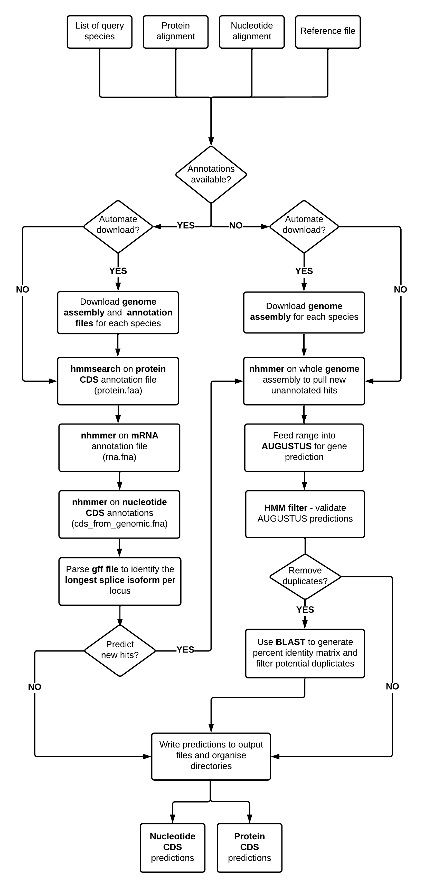

<p align="left">


<hr>

<br>

### <ins>Dependencies:</ins>

<br>

<ol type="1">
  
#### <li>HMMER and easel miniapps:</li>
To install hmmer and easel miniapps, please follow instructions from the HMMER user manual (pgs 17-18): <p>
http://eddylab.org/software/hmmer/Userguide.pdf </p>

<p></p>

Alternatively, please visit the HMMER github page for instructions:

https://github.com/EddyRivasLab/hmmer

<br></br>

#### <li>AUGUSTUS:</li>
<b>Quick install with root privilages:</b>
```
sudo apt-get update
sudo apt-get install augustus
```

<p></p>

<b> Install AUGUSTUS with conda: </b>
```
conda install -c bioconda AUGUSTUS
```

<p></p>

<p><b>Install AUGUSTUS from source </b></p>
<p>AUGUSTUS dependencies: https://github.com/Gaius-AUGUSTUS/AUGUSTUS/blob/master/docs/INSTALL.md </p>
<p>Build AUGUSTUS: https://github.com/Gaius-AUGUSTUS/AUGUSTUS </p>

<p>Make sure to set your AUGUSTUS_CONFIG_PATH variable by appending the following to your ~/.bashrc file: </p>

```
export AUGUSTUS_CONFIG_PATH=/my_path_to_AUGUSTUS/AUGUSTUS/config/    #where my_path_to_AUGUSTUS is dependent on where you cloned the AUGUSTUS repo
```

Troubleshooting:
If you have trouble installing AUGUSTUS from source, try setting the ZINPUT and COMPGENEPRED variables in the common.mk file to false.


<p></p>
<p></p>

 <b> Blat2hints:</b>
 
 GENE-FAM requires the blat2hints.pl script from AUGUSTUS. 
 
 Please download the script from the AUGUSTUS github page as linked below, and place the script in your working directory.
 https://github.com/nextgenusfs/AUGUSTUS/blob/master/scripts/blat2hints.pl 
 
<br>

 
#### <li>BLAT:</li>
AUGUSTUS requires BLAT to generate hints. Please follow the installation instructions found here: <p>
https://bioinformaticsreview.com/20200822/installing-blat-a-pairwise-alignment-tool-on-ubuntu/ 

You may encounter the following error when installing blat: configure: "error: zlib not installed". To overcome this issue, try executing the following command:
```
sudo apt-get install zlib1g-dev
```

<br>

#### <li>BLAST (optional) :</li>
BLAST is only required if you want to remove potential duplicates in the output CDS files based on percentage identity. If you do not wish to use this feature, you do not need to install BLAST.

<b>Quick install with root privilages:</b>
```
sudo apt-get update
sudo apt-get -y install ncbi-blast+
```

<b>Install BLAST from source:</b> <p>
Please download the latest version of BLAST from the following site:
https://ftp.ncbi.nlm.nih.gov/blast/executables/blast+/LATEST/

For instructions on how to configure BLAST, please see the NCBI website linked here:
https://www.ncbi.nlm.nih.gov/books/NBK52640/


</ol>
</p>

<br>
<br>

### <ins>The Pipeline:</ins>
<br>
<br>

<p align="center">

</p>

<br>


### <ins>Running GENE-FAM:</ins>

<p>Prior to running GENE-FAM, the user should prepare their working directory and specify their input files as outlined in the instructions below. </p>
<p></p>To run the <b>GENE-FAM</b> pipeline, please use the following command:</p>

```
perl GENE-FAM.pl
```

<br>
<br>

### <ins> Preparing your working directory: </ins>

In order for the pipeline to work, you must first prepare your working directory with the required input files. The following files should be placed in your working directory: </p>

<br>

#### <ins>Scripts</ins>:

<ol type="1">
  
<li> <b> GENE-FAM.pl :</b></li> This is the pipeline script, which should be downloaded from this github repository. </p>
<li><b> blast2hints.pl :</b> </li> This script is required to generate hints which guide AUGUSTUS gene prediction. Please download this from the AUGUSTUS github repository (link above).

</ol>

<br>
  
#### <ins>Input Files</ins>: 

<ol type="1">
<li> <b> Protein alignment file: </b> </li> This protein alignment file should contain aligned amino acid sequences from your gene family of interest. If you are interested in a gene family in which members share a conserved domain, this alignment may contain sequences for the domain of interest. Seed alignments for your domain of interest may be available for download from the Interpro database. </p>

<li> <b> Nucleotide alignment file: </b> </li> This nucleotide alignment file should contain aligned nucleotide sequences from your gene family of interest. Similarly to the protein alignment, this alignment may contain aligned sequences for a conserved domain of interest. </p>

<li> <b> Reference file: </b> </li> This file is used to guide AUGUSTUS gene prediction. This file should be in fasta format, and should contain nucleotide mRNA sequences from closely related species for your gene family of interest. </p>

<li> <b> Species list: </b> </li> This file is only required if you wish to automate the download of annotation files for a list of query species. This txt file should contain the species names, exactly as they appear on the NCBI RefSeq database. Please note that this feature only works for reference genomes which are available on the NCBI RefSeq database.

</ol> 
</ol>

<br>

#### <ins>Assembly and Annotation files:</ins>
If your query species is available on RefSeq, and the genome assembly of interest is the reference genome for that species, then the genome assembly and following annotation files can be automatically downloaded using GENE-FAM (please see options and parameters below). Otherwise, you should manually download the following files from the NCBI database for your query species. Note, if no annotation files are available for your query species, only the genome assembly should be downloaded and the $annotation_available option should be set to "no" in the GENE-FAM.pl script (please see below for instructions).

<ol type="1">
  
<li> <b> Genome assembly:</b></li> This is the genome assembly for your query species. The genome file should end in "genomic.fna" if downloaded from the NCBI database.  </li></p>
<li> <b> Protein CDS annotations:</b></li> These are the protein coding sequence annotations downloaded from the NCBI RefSeq database. This file should end in "protein.faa". </li></p>
<li> <b> Nucleotide CDS annotations: </b></li> These are the nucleotide coding sequence annotations downloaded from the NCBI RefSeq database. This file should end in "cds_from_genomic.fna". </li></p>
<li> <b> mRNA annotations:</li> </b> These are the mRNA annotations downloaded from the NCBI RefSeq database. This file should end in "rna.fna". </li></p>
<li> <b> GFF file: </b></li> This is the GFF annotation file downloaded from the NCBI RefSeq database. This file should end in "genomic.gff".  </li>
</p>

</ol>

<br>
<br>

### <ins> Specifying your input files, options and parameters:</ins>

To specify your input files, options and parameters please open the <b>GENE-FAM.pl</b> script with a text editor and edit the variables on the lines outlined below. 

<br>

<b>
  
#### <ins> Input files and profile HMMs: </ins>


</b> 

To specify the name of your protein alignment file, please set the $pfam_seed variable on line 17 as follows:
```
$pfam_seed = "protein_alignment.aln"; #Line 17
```

</p>

To specify the name of your nucleotide alignment file, please set the $nuc_alignment variable on line 18 as follows:
```
$nuc_alignmnent = "nucletide_alignment.aln"; #Line 18
```

</p>
  
If the AUGUSTUS prediction ($predict_new_hits) option is on, please enter the name of your reference file on line 21 as follows:
```
$reference_file = "reference_file_name.fa"; #Line 21
```
</p>

Profile HMMs will be automatically built from your alignment files. To specify the names of these profile HMMs, the following variables on lines 24 and 25 should be set as follows:
```
my $phmm_profile = "my_name.hmm"; #Please note that this must end in ".hmm". #Line 24
my $nhmm_profile = "my_name.hmm"; #Please note that this must end in ".hmm". #Line 25
```


</ul>
<br>

#### <ins> Options and parameters:</ins> 

<br>

<li> <b>General options:</b> </li> </p>

If NCBI RefSeq annotations are available for your genome, set the $annotation_available variable on line 33 to "yes". Set as "no" if no annotations are available, and you wish to mine the assembly only:
```
$annotation_available = "yes"; #Line 33
```
</p>

If you want to automate the download of genome assemblies and annotation files for your given target species, please set the $automate_download variable on line 36 to "yes". Please note that this feature only downloads annotation files for reference species on the NCBI RefSeq database. If your target genome is not the reference genome for your query species, or if the genome assembly does not exist on RefSeq, please set this variable to "no" and download the appropriate files manually.
```
$automate_download = "yes"; #Line 36
```
</p>

If you selected "yes" for the $automate_download option, please specify your query species name(s) in a text file. Please specify the name of this text file on line 37 as follows:
```
$species_list = "species.txt"; #Line 37
```

</p>
<br>

<li> <b>HMMER e-values:</b> </li> </p>

If you wish to use the default e-value (1e-5) for <b> hmmsearch (protein) </b>, please set the $default_phmmer_evalue variable to "yes" on line 40. For custom e-values, set this variable to "no".
```
$default_phmmer_evalue = "yes"; #Line 40
```
</p>

If the $default_phmmer_evalue is set to "no", enter your custom e-value for <b> hmmsearch (protein) </b> on line 41 as follows:
```
$phmmer_evalue = "1e-5"; #Line 41
```
</p>

If you wish to use the default e-value (1e-5) for <b> nhmmer (nucleotide) </b>, please set the $default_nhmmer_evalue variable to "yes" on line 40. For custom e-values, set this variable to "no".
```
$default_nhmmer_evalue = "yes"; #Line 44
```
</p>

If $default_nhmmer_evalue is set to "no", enter your custom e-value for <b> nhmmer (nucleotide) </b> on line 45 as follows:	
```
$nhmmer_evalue = "1e-5"; #Line 45
```
</p>
<br>

<li> <b>AUGUSTUS options and parameters:</b> </li> </p>

If you want to predict new hits with AUGUSTUS, set the $predict_new_hits variable on line 48 to "yes". If AUGUSTUS is not installed, set this as "no":
```
$predict_new_hits = "yes"; #Line 48
```
</p>

If using AUGUSTUS, the $AUGUSTUS_species variable corresponds to the species that AUGUSTUS is trained on. Please set your closely related AUGUSTUS species on line 49. For the list of available species, please visit the AUGUSTUS page linked here: https://github.com/Gaius-AUGUSTUS/AUGUSTUS/blob/master/docs/RUNNING-AUGUSTUS.md .
```
$AUGUSTUS_species = "arabidopsis"; #Line 49
```
</p>

If using AUGUSTUS, the $minidentity variable specifies the minimum identity required a reference receptor to be used to generate prediction hints. To specify this parameter, please adjust the $minidentity variable on line 50 as follows. Note that this value is a percentage, and hence should be set as a number between 0 and 100.
```
$minidentity = 60; #Line 50
```
If using AUGUSTUS, the $number_hints option specifies the number of sequences from the reference file that are used to generate hints. For each hit, BLAT is used to identify the top 'n' hits from the reference file. This can either be set to a number greater than 0, or to "all" if you wish to use the entire reference file.
```
my $number_hints = "all";  #Line 51
```
</p>

If using AUGUSTUS, you can chose to append the mined NCBI sequences from each query species to the reference file to guide gene prediction. If you wish to do this, set the $append_query variable on line 52 to "yes". Otherwise, this should be set to "no".
```
my $append_query = "no"; #Line 52
```
</p>

If new hits are predicted with AUGUSTUS, they will be labelled with a prefix defined using the $hit_prefix variable on line 53. For example, if this variable is set to "Hit", new predictions will be labelled as "Hit1", "Hit2" etc. This can be adjusted to suit the use case. 
```
my $hit_prefix = "Hit"; #Line 53
```
</p>

New AUGUSTUS predictions are checked to ensure that the hmmer identified region is retained in each prediction. The $domain_cover_threshold parameter on line 54 specifies the percentage of the hmmer identified region that must be retained in the prediction to be considered valid. This number should be between 0 and 1.
```
my $domain_cover_threshold = 0.9; #Line 54
```

</p>

Each new AUGUSTUS prediction is scanned using HMMER to ensure that the prediction is valid. This HMM filter can use either the protein profile HMM or the nucleotide profile HMM. To select either option, specify the $hmm_filter_type variable on line 55 as either "protein" or "nucleotide".
```
my $hmm_filter_type = "protein"; #Line 55
```

</p>
<br>

<li> <b>Options for nhmmer on the whole genome assembly:</b> </li> </p>

For each novel hit identified with nhmmer on the genome assembly, the nucleotide region upstream and downstream of the hit are retrieved and fed into AUGUSTUS for gene prediction. To specify the amount of nucleotides added to the 3' and 5' ends of the hit prior to gene prediction, please  specify the following variables: </p>

To specify the number of nucleotides added to the 3' end, please define the $nhmmer_plus variable on line 58 as follows:

```
$nhmmer_plus = 20000; #Line 58
```

</p>

To specify the number of nucleotides added to the 5' end, please define the $nhmmer_minus variable on line 59 as follows:
```
$nhmmer_minus = 5000; #Line 59
```
</p>

Running nhmmer on the whole genome assembly can be an intensive task requiring long run-times. To speed up the process for large genomes, an nhmmer database can be generated for the assembly. While, this dramatically speeds up run-times for large genomes, it reduces sensitivity slightly. Hence we recommend that this option is only switched on for large genomes. To specify this option, please set the $nhmmer_genome_database variable on line 62 as either "yes" or "no".
```
my $nhmmer_genome_database = "no"; #Line 62
```
</p>
<br>

<li> <b>Pseudogene classification options:</b> </li> </p>

If you wish to annotate each mined sequence as "pseudogene" or "functional", the $pseudogene_check variable on line 65 should be set to "yes". If this option is switched on, each coding sequence with in-frame stop codons or below a user-defined length threshold will be annotated as pseudogenes. To turn this feature off, please set this variable to "no".
```
$pseudogene_check = "yes"; #Line 65
```
</p>

If the $pseudogene_check option is switched on, the $pseudogene_length variable on line 66 corresponds to the length threshold for pseudogene annotation status. Coding sequences below this length are considered pseudogenes (nucleotide length).
```
$pseudogene_length = 300; #Line 66 
```
</p>
<br>

<li> <b> Removing duplicates options:</b> </li> </p>

If you want to remove duplicates which may arise due to assembly error, set the $remove_duplicates variable on line 69 to "yes". This option will use BLAST on the mined protein annotations to create a percent identity matrix to identify potential duplicates. The duplicate on the largest contig is retained. If you do not wish to avail of this feature, please set this variable to "no".
```
my $remove_duplicates = "no"; #Line 69
```
</p>

To specify the percentage identity threshold for which genes are considered duplicates, please set the $duplicate_threshold variable on line 70. Note that this is a percentage corresponding to amino acid identity and should set to a number between 0 and 1.
```
my $duplicate_threshold = 0.9; #Line 70
```
</p>

<p>When identifying potential duplicates, the pipeline can make use of two distinct algorithms - "pairwise" or "clustered".</p>
<p> In the <b>"pairwise"</b> algorithm, duplicate pairs are identified as mutual best scoring hits in the percent identity matrix. Note that more than 2 members may exist in a given pair, if each member shares the same maximum identity score. Mutual best scores are only considered pairs if they exceed the $duplicate_threshold set above. The member in each pair which is located on the longest contig is retained. </p> 
<p> In the <b>"clustered"</b> algorithm, genes which share percent identity greater than the user defined threshold are combined into clusters. The member in each cluster which is located on the longest contig is retained. </p>
<p>To specify whether you want to use the "pairwise" or "clustered" algorithms, please set the $duplicate_type variable on line 71 as follows:</p>

```
my $duplicate_type = "clustered"; #Line 71
```
</p>
<br>

<li> <b>Adjusting the number of threads:</b> </li> </p>

To increase the number of threads used for HMMER and BLAST, please adjust the $threads variable on line 74  accordingly.
```
my $threads = 8; #Line 74
```

<b>
</ul>
<br>


